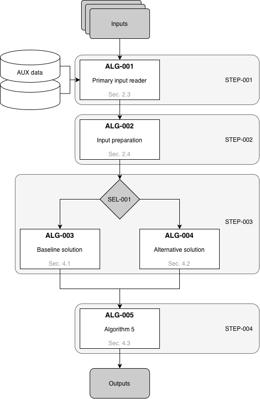

################################
 Processing model and data flow
################################

Overview and top-down decomposition
===================================

[High-level description of the processing chain, and the detail of each
processing function, with a bullet list of the main processing steps and their
corresponding algorithm sections.]

Rationale
=========

[Processing model rationale, providing justification for the chosen approach,
for the inputs selection, and any trade-offs considered (optional)]

End-to-end data flow
====================

[Diagram illustrating the processing flow, including iterations, conditional
branches, significant dependencies, complex mathematical sequences or
concurrent execution, using the same ``STEP``, and ``ALG`` identifiers and
providing cross-references to the corresponding sections.]

Example:

The diagram in :numref:`Figure %s <fig-processing-flow>` illustrates the
data-flow and the relations between processing blocks.

.. _fig-processing-flow:

          processing blocks.
    :width: 80%
    :align: center

    Example of a diagram illustrating the relationships between processing
    blocks.

Algorithms and processing blocks
--------------------------------

Processing steps identification:

.. list-table:: Processing steps and algorithm mapping.
    :header-rows: 1
    :widths: 13 22 22 25 18

    * - Step-ID
      - Name
      - Processing block(s)
      - I/O definition
      - Defined in
    * - STEP-001
      - Primary and auxiliary data reading
      - ALG-001
      - Input products and AUX data to ingested data
      - :numref:`%s <alg-001>`
    * - STEP-002
      - Input preparation
      - ALG-002
      - Ingested data to prepared data
      - :numref:`%s <alg-002>`
    * - STEP-003
      - Branch selection and core processing
      - SEL-001; ALG-003 or ALG-004
      - Prepared data to intermediate result
      - :numref:`%s <control-logic>`; :numref:`%s <alg-003>`; :numref:`%s
        <alg-004>`
    * - STEP-004
      - Output generation
      - ALG-005
      - Intermediate result to output product
      - :numref:`%s <alg-005>`

.. _control-logic:

Control logic, optional steps and switches
------------------------------------------

[Control logic description, including optional steps and switches to select
among alternative algorithms, with identification of the configuration
parameters controlling the switches, to be included in the inputs table,
providing the default values and the reference to the configuration file
document.]

example:

``SEL-001`` selects the processing branch according to the incidence angle. If
the incidence angle is greater than the configurable threshold
``inc_angle_threshold`` (default: ``40 deg``), the alternative solution
``ALG-004`` is executed; otherwise, the baseline solution ``ALG-003`` is used.

[The threshold shall be reported in the inputs table and traced to the
applicable configuration file document.]
